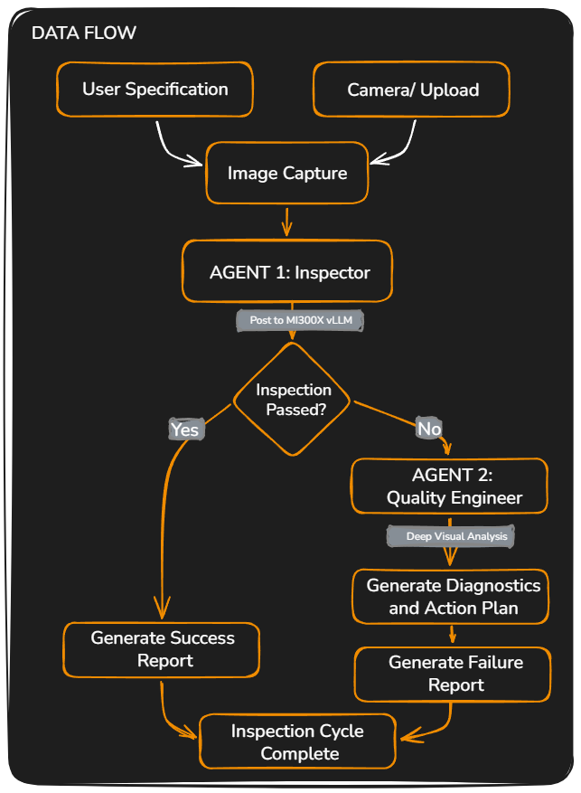

<p align="center">
  <picture>
    <source media="(prefers-color-scheme: dark)" srcset="assets/logo_dark.png">
    <source media="(prefers-color-scheme: light)" srcset="assets/logo1.PNG">
    
  </picture>
</p>

<h3 align="center">Describe what should exist. The AI verifies it visually.</h3>

<p align="center">
  
  
  
  
  
  
</p>

<p align="center">
  <a href="#-live-demo--resources"><strong>Try the Demo</strong></a> ·
  <a href="#-getting-started"><strong>Quick Start</strong></a> ·
  <a href="https://github.com/JaDi03/AsBuilt-Lens/issues"><strong>Report Bug</strong></a>
</p>

---

## 🎯 The Problem

Industrial quality inspection is broken for small and mid-size manufacturers.

**Traditional automated systems** (Automated Optical Inspection - AOI) require:
- Labeled datasets curated by ML specialists - **thousands of images per defect type**
- Model retraining for every new product - **weeks of engineering per SKU**
- Physical camera and sensor calibration per assembly line
- Dedicated hardware costing **$50,000-$200,000 per station**

The result: **80% of manufacturing plants still rely on manual human inspection**, where fatigue reduces accuracy by up to 34% after just 4 hours of continuous work. SMEs and workshops simply cannot afford automated alternatives.

> The global AOI market is valued at **$2.4 billion** and growing at **15% annually**, yet the majority of this market is locked behind enterprise-grade budgets and specialized ML teams.

---

## ✨ The Solution: Multi-Agent Zero-Shot Inspection

**AsBuilt Lens** eliminates the entire training-and-calibration cycle. Instead of programming rules or labeling datasets, operators simply **describe the inspection in plain English** - the same way they would instruct a human inspector.

```
"Expected items: 4x resistor, 1x electrolytic capacitor, 1x IC chip, 1x LED"
```

The system handles the rest through an autonomous **Dual-Agent Workflow** running on the AMD MI300X:

1. **Describe** → Write or select a natural-language inspection specification
2. **Capture** → Upload an image or use a live camera with automatic stability detection
3. **[AGENT 1] Inspector** → Analyzes the image against the spec to generate a structured PASS/FAIL verdict, per-item status, and bounding boxes.
4. **[AGENT 2] Quality Engineer** → *Autonomous Handoff:* If Agent 1 detects a failure, Agent 2 is triggered automatically. It performs a secondary deep multimodal analysis to determine the root cause, severity, and recommends a detailed Corrective Action Plan.

**Zero training. Zero datasets. Zero reconfiguration when switching products.**

---

## 🔑 Key Features

| Feature | Description |
|---------|-------------|
| **Zero-Shot Inspection** | No ML training required. Write a spec in plain English, run the inspection. |
| **Live Camera Mode** | Webcam or IP camera (DroidCam/IP Webcam) with automatic motion-stability detection and hands-free capture. |
| **Upload Mode** | Upload any image (JPG, PNG, WEBP, BMP) for offline or batch inspection. |
| **Auto-Discovery** | Let the AI identify all visible components before you write your specification. |
| **Structured JSON Results** | Item-by-item status, detected counts, confidence scores, and human-readable summary. |
| **Annotated Output Image** | Color-coded bounding boxes and PASS/FAIL badge overlaid directly on the inspected image. |
| **Downloadable Inspection Report** | Auto-generated professional HTML report with full results - ready for QA records or audit trails. |
| **Inspection History** | Every run is logged in the sidebar with timestamp, pass rate, and specification. |
| **Built-in Templates** | Ready-to-use templates for PCB Assembly, Tool Kits, Electrical Panels, and Packaging. |
| **Demo Mode** | One-click demo with a pre-loaded PCB sample image - no hardware needed. |

---

## 💰 Business Value & Market Opportunity

### Target Market

| Metric | Value |
|--------|-------|
| **TAM** | Global AOI market ≈ **$2.4 billion**, growing 15% CAGR |
| **Target Segment** | SMEs, repair shops, quality labs underserved by traditional AOI |
| **Pricing Model** | SaaS - $0.05/inspection or monthly license ($99-$499/month) |

### Why We Win

| | AsBuilt Lens | Traditional AOI | Cloud AI Platforms |
|---|:---:|:---:|:---:|
| **Setup Time** | **Minutes** | Weeks–Months | Days–Weeks |
| **Training Data Required** | **None** | 1000s of labeled images | 100s of examples |
| **Hardware Cost** | **$0** (cloud inference) | $50K–$200K | $0 (but SaaS fees) |
| **Product Flexibility** | **Change the text, done** | Full recalibration | Retrain model |
| **Data Sovereignty** | **Full** (on-premise capable) | Full | Vendor-dependent |
| **Analysis Type** | **Semantic reasoning** (what + why) | Binary OK/NOK | Binary + localization |

### Competitive Edge

Traditional systems give you a binary verdict: "Good" or "Bad." AsBuilt Lens **reasons** about what it sees - it can tell you *what* is missing, *how many* were expected versus detected, and provide factual observations about anomalies. This enables root-cause analysis directly from the inspection step.

---

## 🏗️ Architecture

```
AsBuilt-Lens/
├── app/
│   ├── app.py              # Main Streamlit UI & application loop
│   ├── config.py           # Environment variable loading & constants
│   ├── inspector.py        # [AGENT 1] Visual inspection logic & VLM calls
│   ├── quality_engineer.py # [AGENT 2] Autonomous root-cause analysis logic
│   ├── camera.py           # Webcam/IP camera management & stability detection
│   ├── utils.py            # Image annotation, formatting utilities
│   ├── report.py           # Automated inspection report generator
│   └── prompts/
│       └── inspection_prompt.txt  # Structured prompt template for Qwen3-VL
├── assets/
│   ├── logo_dark.png       # UI logo (dark mode optimized)
│   ├── demo_pcb.jpg        # Demo image for one-click testing
│   ├── cover.png           # Hackathon submission cover (16:9)
│   └── og-image.png        # Social sharing preview image
├── docs/
│   └── technical_document.md  # Full technical specification
├── .streamlit/
│   └── config.toml         # Streamlit theme (Phoenix dark mode)
├── .env.example            # Environment variable template
├── requirements.txt
└── README.md
```

### Data Flow



---

## ⚡ AMD ROCm Deployment & Performance

### Infrastructure

AsBuilt Lens runs inference on **AMD Instinct MI300X** GPUs via the **AMD Developer Cloud**. The MI300X provides 192 GB of HBM3 memory, enabling the full Qwen3-VL-32B model to run without quantization or sharding compromises.

### vLLM Server Configuration

```bash
# Deploy Qwen3-VL on AMD MI300X via vLLM (ROCm)
python -m vllm.entrypoints.openai.api_server \
  --model Qwen/Qwen3-VL-32B-Instruct \
  --port 8000 \
  --trust-remote-code \
  --max-model-len 32768
```

**Key Configuration Details:**

| Parameter | Value | Rationale |
|-----------|-------|-----------|
| `--max-model-len` | 32768 | Sufficient headroom for base64 image tokens + structured JSON output |
| `--temperature` | 0.1 | Near-deterministic output for consistent inspections |
| `--max-tokens` | 2048 | Enough for detailed multi-item inspection results with bounding boxes |
| Image preprocessing | 720p max, JPEG 85% quality | Optimal balance between visual detail and token budget |

### ROCm Optimization Notes

- **Engine**: vLLM on ROCm — native AMD GPU acceleration without CUDA translation layers
- **Memory Advantage**: MI300X's 192 GB HBM3 fits the full 32B parameter model with ample KV-cache space for long multimodal contexts
- **API Format**: OpenAI-compatible REST endpoint — standard tooling, no proprietary SDKs

> **Performance Target**: End-to-end inspection (image upload → structured result) in **≤ 8 seconds** for standard PCB images at 720p resolution.

---

## 🚀 Getting Started

### 1. Clone the repository

```bash
git clone https://github.com/JaDi03/AsBuilt-Lens.git
cd AsBuilt-Lens
```

### 2. Install dependencies

```bash
pip install -r requirements.txt
```

### 3. Configure your environment

```bash
cp .env.example .env
```

Edit `.env` with your AMD Developer Cloud endpoint:

```env
# AMD Developer Cloud
AMD_API_URL=http://your-mi300x-ip:8000/v1
AMD_API_KEY=your_api_key_if_needed
VLM_MODEL=Qwen/Qwen3-VL-32B-Instruct

# Camera (optional — only needed for Live Camera mode)
CAMERA_URL=http://192.168.1.100:8080/video

# Tuning
STABILITY_THRESHOLD=0.02
STABILITY_FRAMES=30
MAX_IMAGE_SIZE=720
```

### 4. Run the application

```bash
python -m streamlit run app/app.py
```

Open your browser at `http://localhost:8501`.

---

## 📷 Live Camera Setup

**Option A — Laptop Webcam**
1. Select **"Laptop Webcam"** in the sidebar.
2. Click **▶️ Start Camera**.
3. Hold your object steady. The stability bar fills up and auto-captures.

**Option B — Phone as IP Camera**
1. Install [IP Webcam](https://play.google.com/store/apps/details?id=com.pas.webcam) (Android) or [DroidCam](https://www.dev47apps.com/).
2. Connect your phone to the same Wi-Fi network as your PC.
3. Set `CAMERA_URL` in your `.env` to the stream URL shown in the app.
4. Select **"Phone IP Camera"** in the sidebar and click **▶️ Start Camera**.

---

## 📋 Inspection Templates

| Template | Use Case |
|----------|----------|
| **PCB Assembly** | Verify resistors, capacitors, IC chips, LEDs, oscillators |
| **Packaging Verification** | Check product, manual, warranty card, accessories |
| **Tool Kit Inspection** | Verify presence of specific hand tools |
| **Electrical Panel** | Check breakers, bus bars, labels, wiring safety |
| **Custom Specification** | Write your own natural-language checklist |

---

## 📊 Example Result

```json
{
  "inspection_passed": true,
  "items": [
    { "id": "resistor", "expected_count": 4, "detected_count": 4, "status": "present", "confidence": 94 },
    { "id": "electrolytic_capacitor", "expected_count": 1, "detected_count": 1, "status": "present", "confidence": 91 },
    { "id": "ic_chip", "expected_count": 1, "detected_count": 1, "status": "present", "confidence": 97 },
    { "id": "led", "expected_count": 1, "detected_count": 0, "status": "missing", "confidence": 88, "note": "No LED visible in expected location." }
  ],
  "summary": "3 of 4 items verified. LED component not detected — recheck position D1.",
  "notes": ""
}
```

---

## 🛠️ Tech Stack

| Component | Technology | Role |
|-----------|------------|------|
| **GPU Compute** | AMD Instinct MI300X (192 GB HBM3) | Multimodal model inference |
| **Inference Engine** | vLLM on ROCm | High-performance serving with continuous batching |
| **Vision Model** | Qwen3-VL-32B-Instruct | Zero-shot multimodal reasoning |
| **API Protocol** | OpenAI-compatible REST | Standard integration, no proprietary SDKs |
| **Frontend** | Streamlit 1.30+ | Interactive inspection interface |
| **Computer Vision** | OpenCV 4.8+ | Camera capture, stability detection |
| **Image Processing** | Pillow 10+ | Image manipulation and annotation |
| **Runtime** | Python 3.10+ | Application logic |

---

## 🎥 Live Demo & Resources

| Resource | Link |
|----------|------|
| 📹 **Video Demo** | [Coming Soon](#) |
| 🤗 **Hugging Face Space** | [Coming Soon](#) |
| 📄 **Technical Document** | [docs/technical_document.md](docs/technical_document.md) |
| 📂 **GitHub Repository** | [github.com/JaDi03/AsBuilt-Lens](https://github.com/JaDi03/AsBuilt-Lens) |

---

## 📈 Roadmap

| Phase | Feature | Description |
|-------|---------|-------------|
| ✅ **MVP** | Core Inspection Engine | Upload + camera modes, structured JSON results, annotated images |
| ✅ **MVP** | Inspection Reports | Auto-generated downloadable HTML reports for QA records |
| 🔜 **Next** | Hugging Face Space | Public demo for judges and community (upload mode) |
| 🔮 **Future** | Edge Inference | AMD Ryzen AI deployment for factory-floor use without cloud |
| 🔮 **Future** | Multi-Camera Networks | Multiple inspection stations feeding a central dashboard |
| 🔮 **Future** | ERP/MES Integration | Automatic pass/fail logging into manufacturing execution systems |
| 🔮 **Future** | Inspection Analytics | Defect trend monitoring and line performance dashboards |

---

## 🏆 Hackathon Submission

- **Event**: [AMD Developer Hackathon 2026](https://lablab.ai/ai-hackathons/amd-developer)
- **Track**: Track 3 — Vision & Multimodal AI
- **Team**: AsBuilt Lens Team
- **Model**: Qwen3-VL-32B-Instruct on AMD MI300X via ROCm + vLLM
- **Challenge Alignment**: Track 3 ✅ · Qwen Challenge ✅ · Ship It + Build in Public ✅

---

## 📄 License

MIT License — see [LICENSE](LICENSE) for details.
